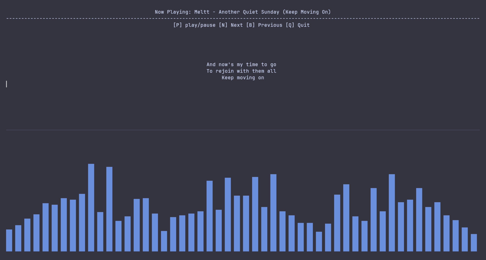
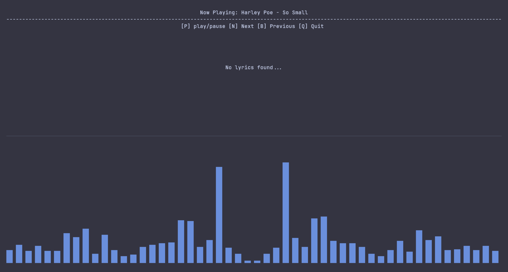
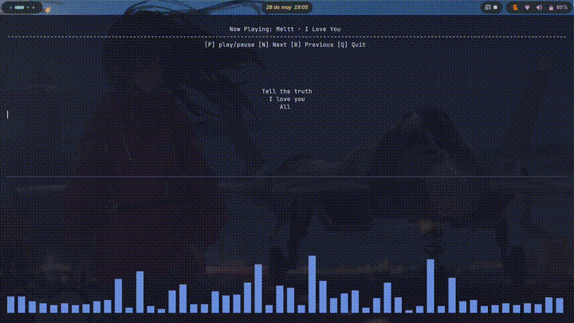

# Noctune

Es una pequeña herramienta hecha para la terminal aun en mejora :D
cuenta con:

- Letras sincronizadas
- Visualización de audio en tiempo real usando cava
- Integración con tmux
- Control de música mediante playerctl
- Experiencia completamente en terminal

---

## Vista previa
### imagenes de caso



### video de uso

---

## Características

- Letras sincronizadas en tiempo real
- Animación progresiva de letras
- Visualizador de audio con cava
- Controles multimedia globales
- Interfaz basada en terminal con tmux

---

## Controles

| Tecla   | Acción            |
| ------- | ----------------- |
| Alt + P | Play / Pause      |
| Alt + N | Siguiente canción |
| Alt + B | Canción anterior  |
| Alt + Q | Salir de Noctune  |

---

## Instalación

Clona el repositorio:
```bash
git clone https://github.com/Kevin-LemusOrt/Noctune
cd Noctune
```

Dale permisos al instalador
```bash
chmod +x install.sh
```

Ejecuta el instalador
```bash
./install.sh
```

Ejecute Noctune
```bash
noctune
```

# Troubleshooting

Si los archivos del sistema se crean pero quedan vacíos o incompletos, el instalador intentará nuevamente restaurarlos.

Esto puede ocurrir en casos como:

- interrupción del proceso de instalación
- problemas de permisos
- ejecución parcial del script
- fallos al escribir el launcher o configuración de tmux

En caso de que no se auto reparen al volcer a ejecutar el instal.sh puede arreglarlo manualmente:

## Si el archivo de configuración de tmux o la sesión de Noctune existe pero están vacío

### Archivo de configuracion de Tmux
Entra al archivo de configuracion de tmux
```bash
nano ~/.tmux.conf
```
```bash
set -g status off

set -g pane-border-style fg=black
set -g pane-active-border-style fg=black

bind-key -n M-p run-shell "playerctl play-pause"
bind-key -n M-n run-shell "playerctl next"
bind-key -n M-b run-shell "playerctl previous"
bind-key -n M-q kill-session
```

### Launcher de noctune
- Verifica que el archivo del launcher exista:
```bash
ls ~/.local/bin/noctune
```
Si el launcher existe pero este se encuentra vacio agrege manualmente:

```bash
nano ~/.local/bin/noctune
```

```bash
#!/bin/bash

SESSION="noctune"

if tmux has-session -t $SESSION 2>/dev/null; then

    tmux attach-session -t $SESSION

else

    tmux new-session -d -s $SESSION

    tmux send-keys -t $SESSION \
    "cd ~/proyectos/SpotyTerminal && source venv/bin/activate && python main.py" C-m

    tmux split-window -v -t $SESSION

    tmux send-keys -t $SESSION "cava" C-m

    tmux select-pane -t 0

    tmux set-option -t $SESSION remain-on-exit off

    tmux attach-session -t $SESSION

```

## PATH no configurado correctamente
Si el comando noctune no se reconoce después de la instalación, verifique el PATH

```bash
echo $PATH
```

en caso de que no lo este agrege a su shell

```bash
nano ~/.bashrc
nano ~/.zshrc
```

o a la shel que use la siguiente linea:

```bash
export PATH="$HOME/.local/bin:$PATH"
```

cierre la terminal o recargue

```bash
source ~/.bashrc
source ~/.zshrc
```


## Requisitos

* Linux
* tmux
* cava
* playerctl
* Python 3

El instalador se encarga automáticamente de instalar todo lo necesario.

---

## Dependencias de Python

* requests
* rich

---

## Ideas futuras

* múltiples fuentes de letras
* mejor sincronización
* archivos de configuración
---

## Hecho con

* Python
* tmux
* cava
* playerctl
